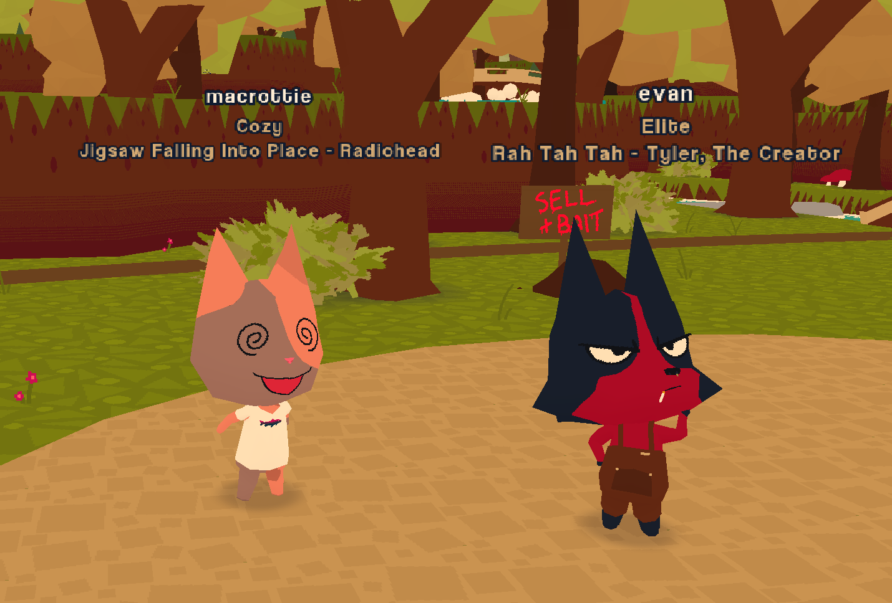

# Let Em Know

A client-side mod that shows what song you're currently listening to under your title.

Note: only players who have the mod can see your status. sorry :(

## Setup

### Cider2 (Paid Apple Music Client)

Enable "RPC Server" and disable API Tokens in Cider connectivity settings, and then you're good to go!

### Last.fm (Spotify, Foobar, YT Music, etc...)

Create a Last.Fm account if you don't already have one and setup scrobbling for your preferred music service.

Then use Tacklebox (recommended) or edit your config file manually to set these options:

- Use LastFm: true
- LastFm Username: (your lastfm username)
- LastFm API Key: (a valid lastfm api key)

Dont have an API Key? Get one at https://www.last.fm/api/account/create